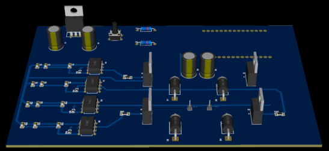
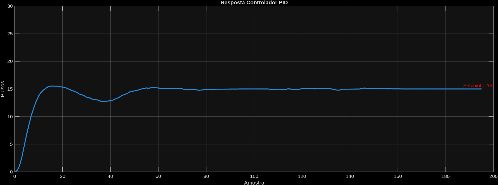
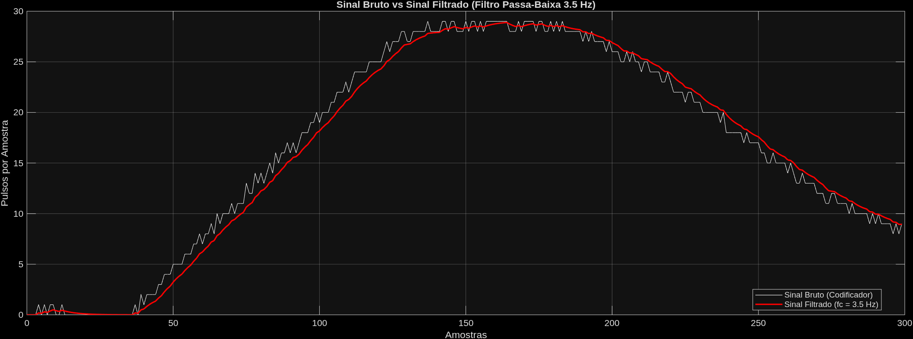
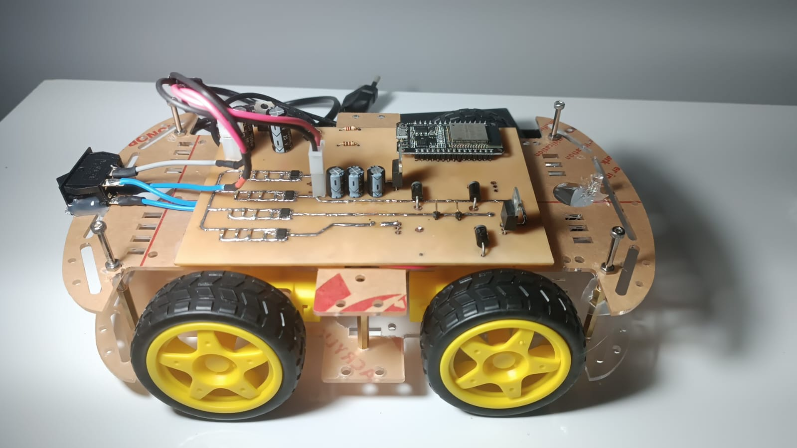

# Piloto Automático com ESP32

## Resumo

Este projeto implementa um sistema embarcado para controle de velocidade de um motor DC utilizando ESP32, controle PID, filtro passa-baixa, leitura de encoder e interface de comunicação UDP para ajuste dinâmico de parâmetros. O objetivo é obter controle preciso e robusto da velocidade do motor, com possibilidade de ajuste remoto dos parâmetros de controle.

---

## Introdução

O sistema realiza o controle de velocidade de um motor DC por meio de um laço fechado, utilizando um encoder para realimentação, um filtro passa-baixa para suavização do sinal e um controlador PID incremental. A interface UDP permite ajuste remoto do setpoint e dos parâmetros PID.

---

## Componentes Eletrônicos e Ligações
- **ESP32**: microcontrolador principal.
- **Motor DC**: atuador controlado.
- **Encoder incremental**: realimentação da velocidade (conectado a GPIOs com suporte a interrupção).
- **Botão**: para comandos locais (start/stop/reset).

## Arquitetura de Software

O software é modular, com os seguintes componentes principais:

- **main/**: inicialização, configuração e laço principal.
- **components/motor/**: abstração e controle do motor via PWM.
- **components/esp-pid-control/**: controlador PID incremental, MISRA C, sem alocação dinâmica.
- **components/low-pass-filter/**: filtro passa-baixa para suavização do sinal do encoder.
- **components/tasks/**: tarefas FreeRTOS para controle, comunicação e botão.
- **components/nvs-helper/**: leitura/escrita de parâmetros persistentes (NVS).
- **components/button/**: gerenciamento de botão físico.
- **components/wifi/**: configuração de AP Wi-Fi e comunicação UDP.
- **components/error-handling/**: tratamento de estados e falhas.

---

## Fluxo de Funcionamento

1. **Inicialização**: configura PWM, encoder, filtro, PID, Wi-Fi e tarefas.
2. **Controle de velocidade**:
   - O encoder mede a velocidade real do motor.
   - O sinal é suavizado por um filtro passa-baixa.
   - O PID calcula o comando de PWM para atingir o setpoint.
   - O PWM é aplicado ao driver de motor.
3. **Ajuste remoto**:
   - Parâmetros PID e setpoint podem ser ajustados via UDP.
   - Parâmetros são salvos em NVS para persistência.
4. **Botão físico**:
   - Permite comandos locais (ex: start/stop/reset).
5. **Monitoramento**:
   - Estado do sistema pode ser monitorado via UDP.

---

## Resultados

O sistema foi testado em bancada com diferentes setpoints de velocidade e cargas mecânicas. Os principais resultados observados foram:

- **Resposta rápida e estável**: O controle PID, aliado ao filtro passa-baixa, proporcionou resposta rápida à variação de setpoint, com sobre-elevação e tempo de acomodação reduzidos.
- **Robustez a ruídos**: O filtro passa-baixa eliminou oscilações indesejadas provenientes do encoder, garantindo leitura estável da velocidade.
- **Ajuste dinâmico**: A interface UDP permitiu ajuste em tempo real dos parâmetros PID e do setpoint, facilitando a sintonia fina do sistema sem necessidade de regravação do firmware.
- **Persistência**: Parâmetros ajustados via UDP foram salvos em NVS, mantendo a configuração mesmo após reinicialização.

